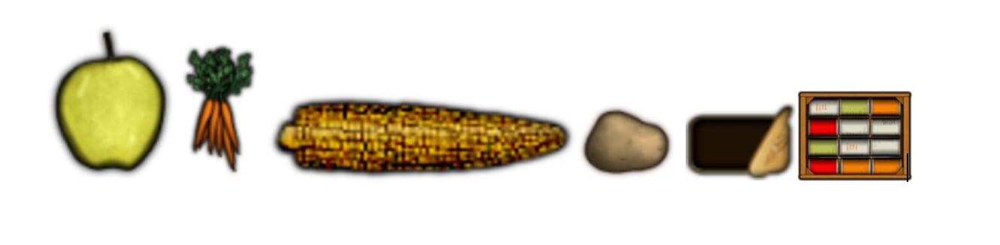

# Zombie Land
Zombie Land is an action-packed survival game where you must fight off hordes of zombies to survive. Your mission is to protect your base and defeat all the zombies. The game features various weapons, including a knife and a firearm, as well as items to restore health. Move through the world using the arrow keys and interact with objects using the 'E' key. The game offers dynamic gameplay and an exciting challenge in a post-apocalyptic world.

The project was developed using the [libGDX](https://libgdx.com/) framework, which was initialized with [gdx-liftoff](https://github.com/libgdx/gdx-liftoff).

## Prerequisites
Before you can run the game, ensure you have the following installed:

- **Gradle 8** or higher: Gradle is used to manage dependencies and build the project. You can download it from [here](https://gradle.org/install/).
- **Java 21**: Java is required to run the project. Make sure you have Java 21 installed. You can download it from [here](https://www.oracle.com/java/technologies/javase/jdk21-archive-downloads.html).

## Platforms
- `core`: Main module with the application logic shared by all platforms.
- `lwjgl3`: Primary desktop platform using LWJGL3.

## Gradle
This project uses [Gradle](https://gradle.org/) to manage dependencies.  
The Gradle wrapper was included, so you can run Gradle tasks using `gradlew.bat` or `./gradlew` commands.

### Key Gradle Tasks:
- `build`: Builds the source and archives of the project.
- `clean`: Removes `build` folders with compiled classes and archives.
- `lwjgl3:run`: Runs the application.
- `test`: Runs unit tests if any are defined.

## How to Run the Game
- Clone or download the project files.

### In IntelliJ IDEA:
1. Open the project in IntelliJ IDEA.
2. Ensure necessary dependencies are imported (Gradle should handle this).
3. At the top, click on **"Current File"** and select **"Edit Configurations"**.
4. Add a new **Application** configuration with the following settings:
    - **Build and Run**: Choose the correct Java version (>= 21).
    - **Module**: Select `PCO_Zombie_Land.lwjgl3.main`.
    - **Main class**: `pco.project.game.lwjgl3.Lwjgl3Launcher`.
5. Click **OK** to save the configuration.
6. Finally, use IntelliJ IDEA's **Run** or **Debug** buttons to start the game.

### Via Terminal:
1. Open a terminal and navigate to the project directory.
2. If you're using a Unix-based system (Linux or macOS), you might need to grant execution permissions to the `gradlew` script by running:
   ```bash
   chmod +x gradlew
   ```
3. Build the project with:
   ```bash
   ./gradlew build
   ```
4. To run the game from the terminal, execute:
   ```bash
   ./gradlew lwjgl3:run
   ```
   or
    ```bash
   ./gradlew run
   ```

### Running the Game with a JAR File:
You can also run the game using the compiled JAR file. Download it from this [link](https://drive.google.com/file/d/1jKYkUzSE-6xvOBCAVHdoINtucQnTNjSR/view?usp=drive_link), then execute:
```bash
java -jar Zombie_Land_Game.jar
```

### Creating an Executable JAR
You can create an executable JAR file for the game by running the following command in the terminal:
```bash
./gradlew lwjgl3:dist
```

Once the process is complete, the JAR file will be generated and located in the following directory:
```bash
./lwjgl3/build/libs/
```

## Gameplay Overview
- **Objective**: Survive by killing all zombies to progress through levels.
- **Weapons**:
    - Press `'P'` to switch between the Knife and the Firearm.
    - Press `'D'` to attack with the Knife or shoot with the Firearm.
- **Health**: Collect health items (blood objects) to restore HP.
- **Movement**: Use the arrow keys to move. Combine directions (e.g., down + right) for diagonal movement.
- **Zoom**: Zoom in with `'W'` and out with `'X'`.
- **Interaction**: Press `'E'` to pick up health items.

### Health Items
You can collect **health items** (blood objects) to restore your health when it drops. These items will be scattered around the map, and you can pick them up by pressing the `'E'` key when near them.  


### Important Notes:
- When starting the game, avoid resizing the first view window, as it may cause the layout (including buttons) to break. The rest of the game scales properly.

## Image of the UML Diagram
You can view the UML diagram of the game architecture here:  
[View UML Diagram](./UMLdiagram/zombie_land_uml_diagaram.jpg)

## Audio and Sound Effects
The zombies emit sound effects when they approach or are killed. Make sure your audio is enabled to experience these effects.

## Configurable Settings
To tweak certain game parameters (such as speed, difficulty, and others), you can modify the `GlobalConst` file.
